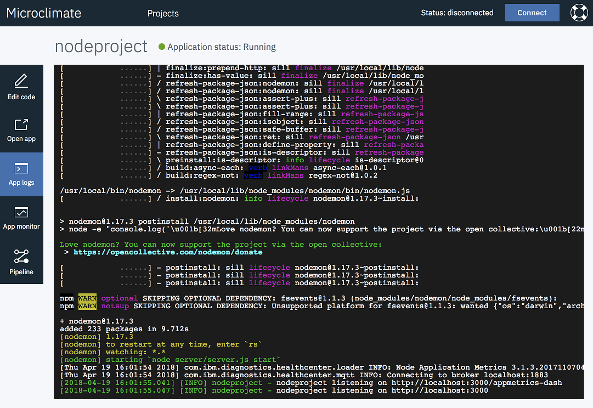

## April release available now!

*Monday, April 30th, 2018*

We are getting our groove on, and have put out another monthly release for you. This one has a few new features, but more importantly we have been doing some work behind the scenes to make our code more robust and clean. 

One of the key features we added was the ability to use Microclimate running locally on your machine to create a pipepline running on ICP that will deploy your app. In addition we added ANSI format support for log files so that we can leverage colors and effects. 

We continue to work away on new features we think will make your life easier. But if there are things we are missing out on, please feel free to hit our [Community](./community) page so you can let us know!

## Releasing Microclimate again, no more betas!

*Friday, March 30th, 2018*

Two short weeks, and it's already time for another Microclimate release! This time there's not much in the way of new function to report as we've spent the time doing some housekeeping, fit and finish, and squashing bugs. Some of us were even lucky enough to join our coming out party at the IBM Think conference (https://www.ibm.com/events/think/) and picked up some snazzy Microclimate laptop stickers and t-shirts. However, based on how far we've come in this release - and more importantly, the progress we're making - we've decided to remove our 'beta' tag. Woo hoo! 4 characters less to type each release!

As a recap, here are some of the things we can do!
- Install locally or on IBM Cloud Private
- Create applications in Java, Node, and Swift
- Applications run in Docker from day one to remove production differences
- Integrated Theia editor with git support, or use your own editor
- Rapid iterative dev - save a change and see it live in seconds!
- Test performance early with app metrics and load testing
- Production pipeline built on Jenkins

## Get ready to kick the tires on another Microclimate beta refresh!

*Sunday, March 18th, 2018*

We have another beta refresh with some additional features for you to check out. We did a refresh on our UI, making things leaner and cleaner, and in the process swapped in Theia as our new browser based IDE. In that shiny new UI,  you will also notice we started adding support for importing existing projects from a Git server (we have even included GitLab if you need it), a local directory, or an archive. For those of you running Microclimate on IBM Cloud Private, you now have the ability to create a devops pipeline that will allow you to automatically deploy your projects from Git to IBM Cloud Private. To learn more about these new features, watch the <a href="#" data-video="videos/think-beta.mp4"  class='showVideo'>Import and devops pipeline video</a>.

We also upped the fun factor by highlighting Rogue Cloud this time around. If you like games, are interested in Microservice development, and would like to use Microclimate to marry those two things together, make your way over to our [Rogue Cloud](./roguecloud) page for the details on how to get up and running.

And remember, our virtual door is always open if you want to chat. We make it easy for you to make contact. Just visit [Community](./community) page to get connected!

## Microclimate beta refresh now available

*Friday, February 16th, 2018*

We are trying to get into a bit of a rhythm here, so we've put out a refresh of our first Microclimate beta. Whilst there might not be any big features being delivered in this particular refresh, we did make some changes to improve our fit and finish, and dropped our overall container footprint significantly as well. Our plan is to incremementally add features and function, so look for further updates from us as we turn out drivers. Head on over to our [Getting Started](./gettingstarted) page for instructions on how to move to the new refresh.

Remember, if you want to influence what enhancements you would like to see, or open up a bug, please visit our [Community](./community) page to find different ways to interact with us. GitHub, Slack, or StackOverflow....we've got you covered!
